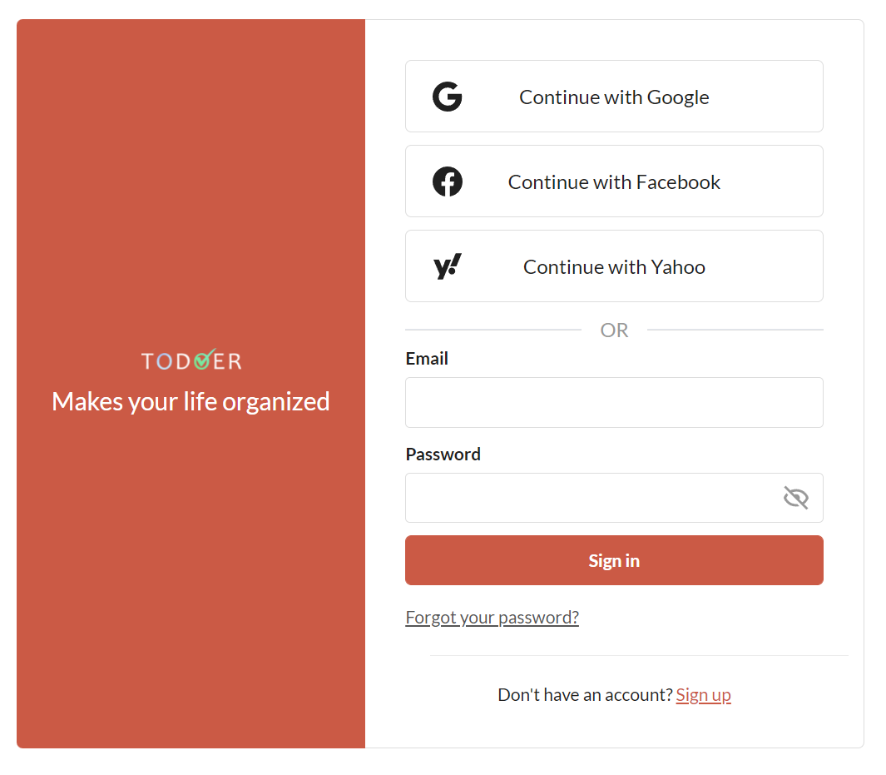
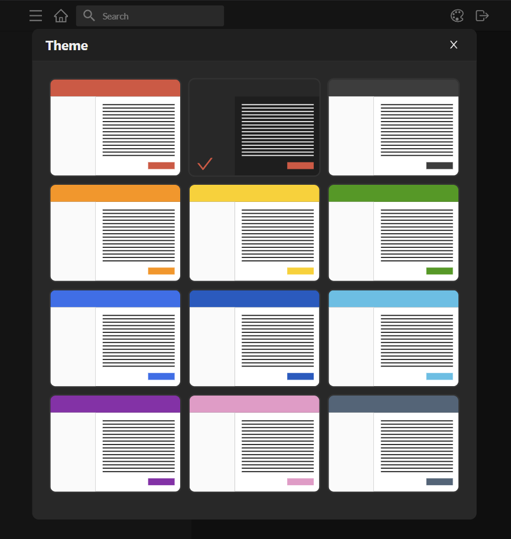
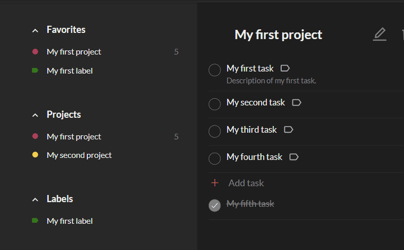
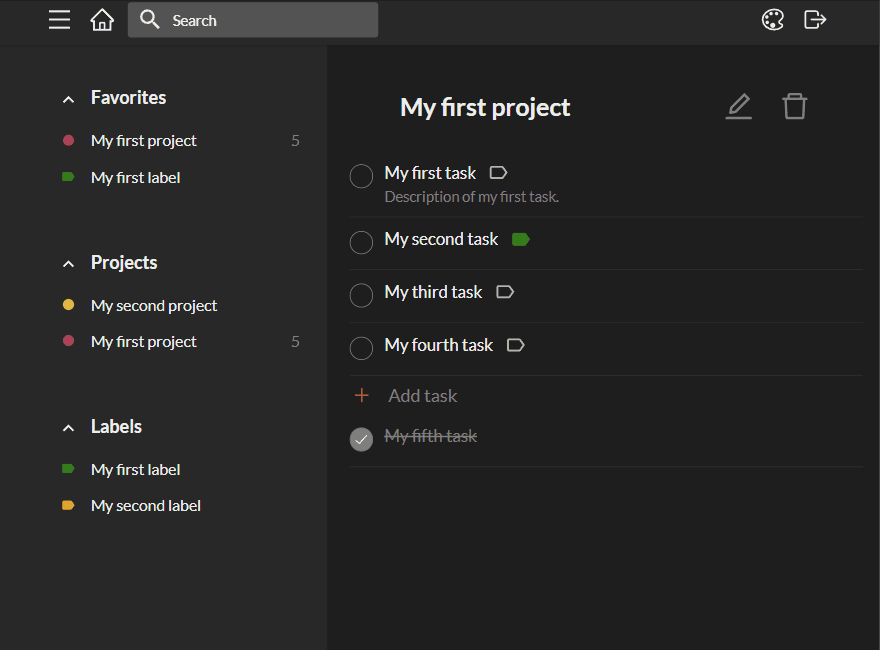
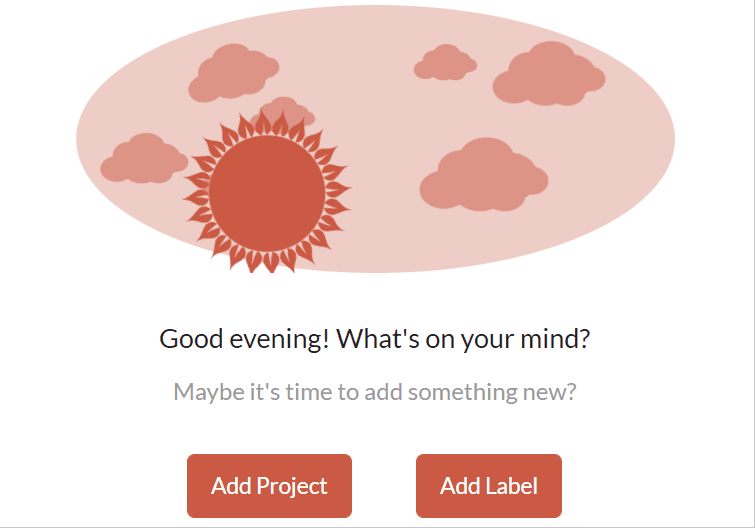
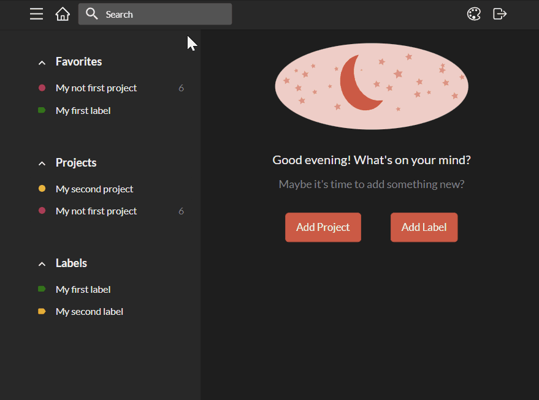
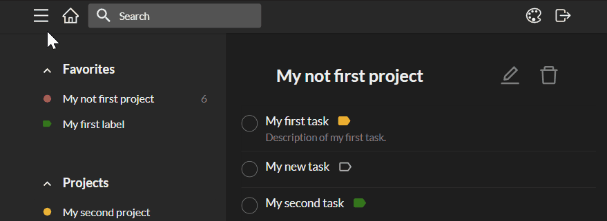

### To-Do application created with [React](https://reactjs.org)

---

## About the app

It is a classical and, at the same time, highly interactive To-Do application that mimics native apps' experience.

The visual design of this application was highly inspired by [Todoist](https://todoist.com/).

---

## About updates

This application is still under development.

_At the moment, all the backend is implemented through [MSW](https://mswjs.io/). In the future, [the real backend](https://github.com/yakoPavel/todoer-server) will be added to the project._

---

## Built with

- Main:
  - [Typescript](https://www.typescriptlang.org/)
  - [React](https://reactjs.org)
- State management:
  - Application state:
    - [Redux](https://redux.js.org/) / [Redux Toolkit](https://redux-toolkit.js.org/)
  - Sever state:
    - [React Query](https://react-query.tanstack.com/)
- User authentication:
  - [Firebase](https://firebase.google.com/)
- Styles:
  - [Emotion](https://emotion.sh/)
- Forms:
  - [Formik](https://formik.org/)
  - [Yup](https://github.com/jquense/yup)
- Testing:
  - Unit and integration tests:
    - [Jest](https://jestjs.io/)
    - [React Testing Library](https://testing-library.com/docs/react-testing-library/intro/)
  - End to end tests:
    - [Cypress](https://www.cypress.io/)
  - Visual tests:
    - [Storybook](https://storybook.js.org/)
  - API mocking:
    - [MSW](https://mswjs.io/)
    - [MSW Data](https://github.com/mswjs/data)
- Tools:
  - [ESLint](https://eslint.org/)
  - [Prettier](https://prettier.io/)
  - [Husky](https://github.com/typicode/husky)
  - [lint-staged](https://github.com/okonet/lint-staged)
- Miscellaneous:
  - [React Beautiful DnD](https://github.com/atlassian/react-beautiful-dnd)
  - [Downshift](https://www.downshift-js.com/)
  - [Chakra UI](https://chakra-ui.com/)
  - [lodash](https://lodash.com/docs/4.17.15)
  - [axios](https://axios-http.com/docs/intro)
  - [others](./package.json)

---

## Some features

Below you can see some of the features implemented by the app.

- ### Advanced Authentication

  The app can authenticate its users through social providers (Google, Facebook, and Yahoo) or an email/password combination.

  

  
<b>Illustration</b>

  

  
  

  

- ### Twelve color themes

  There are a lot of themes that the user can change on the go.

  

  
<b>Illustration</b>

  

  
  

  

- ### Side menu

  The user can change the width of the side menu, reorder the items, add/edit/remove items.

  

  
<b>Illustration</b>

  

  
  

  

- ### Project page

  On this page, the user can:

  - add/edit/remove tasks for the project
  - reorder tasks
  - mark/unmark them as completed
  - change the label to a task
  - edit/remove project

  

  
<b>Illustration</b>

  

  
  

  

- ### Home Page

  The home page image and greeting change depending on the time of day. Additionally, the image is animated with CSS.

  

  
<b>Illustration</b>

  

  
  

  

- ### Search

  The user can search projects/tasks/labels through the search field.

  

  
<b>Illustration</b>

  

  
  

  

- ### Keyboard shortcuts

  The user can use keyboard shortcuts to activate some actions.

  

  
<b>Illustration</b>

  

  
  

  

